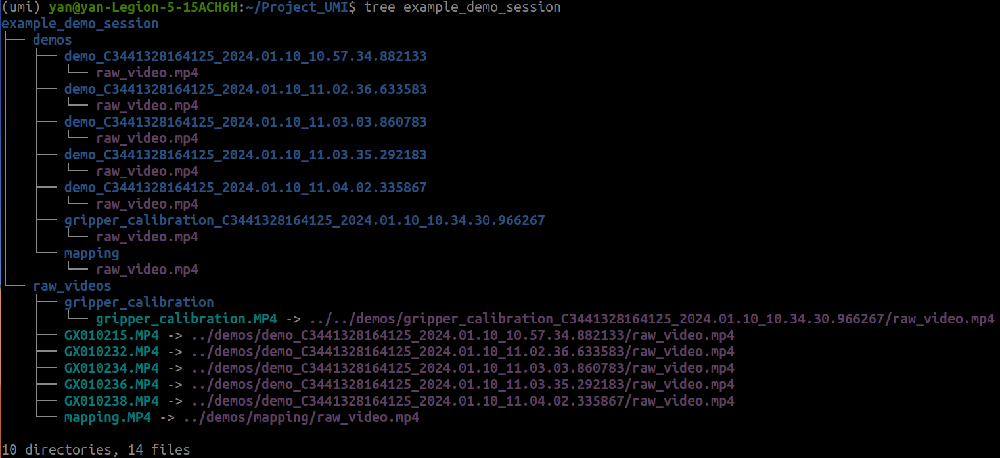
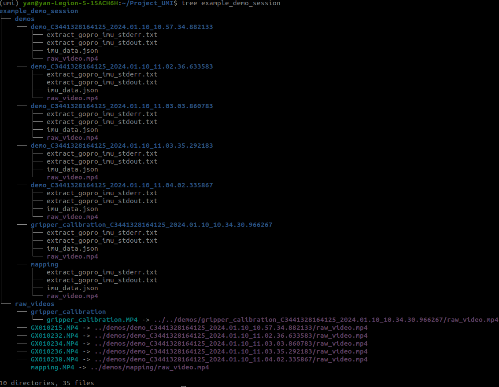
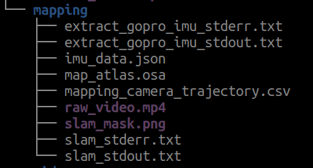
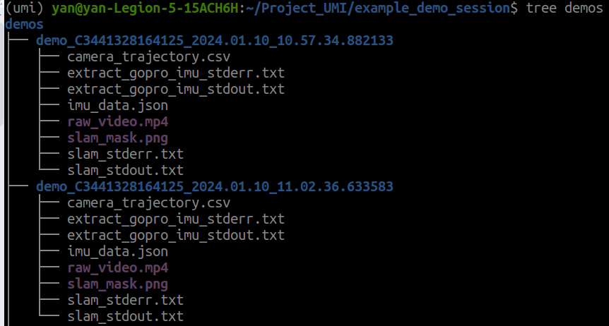
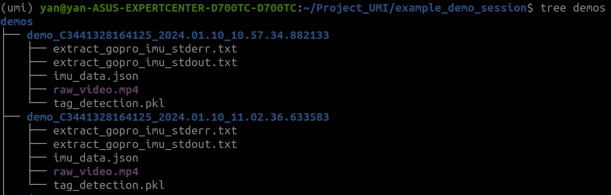

# UMI-Flexiv

[](https://www.python.org/downloads/release/python-370/)
[](https://releases.ubuntu.com/20.04/)
[](https://releases.ubuntu.com/22.04/)

This repository revises the [UMI project](https://umi-gripper.github.io/) to adapt it for use with the Flexiv robotic arm. Additionally, we have modified the code to make it more decoupled, facilitating easier module updates and replacements.

## 💻 Installation
- Install docker following the [official documentation](https://docs.docker.com/engine/install/ubuntu/) and finish [linux-postinstall](https://docs.docker.com/engine/install/linux-postinstall/).

- Install system-level dependencies:
```console
sudo apt install -y libosmesa6-dev libgl1-mesa-glx libglfw3 patchelf
```

- Pull the repo
```console
cd /home/$(whoami)
git clone https://github.com/yding25/Project_UMI.git
```

- Create conda environment
```console
cd /home/$(whoami)/Project_UMI/install
conda env create -f conda_environment.yaml
```

- Activate environment
```console
conda activate umi
```

## 🚀 Running UMI SLAM pipeline

- Prepare a folder to store videos. Please see the [instruction](https://swanky-sphere-ad1.notion.site/UMI-Data-Collection-Tutorial-4db1a1f0f2aa4a2e84d9742720428b4c?pvs=4) of making corresponding videos.
  
```console
mkdir /home/$(whoami)/Project_UMI/example_demo_session
```
- **Step 1:** Prepare and name a video as **gripper_calibration.mp4**

- **Step 2:** Prepare and name a video as **mapping.mp4**

- **Step3:** Prepare a few demo videos, and no need to rename videos

- You can also download example data
```console
cd /home/$(whoami)/Project_UMI
```

```console
wget --recursive --no-parent --no-host-directories --cut-dirs=2 --relative --reject="index.html*" --no-check-certificate https://real.stanford.edu/umi/data/example_demo_session/
```

- Step 0: and you can get the folder **example_demo_session/demos**, where the raw videos are processed. 

```console
python /home/$(whoami)/Project_UMI/scripts_slam_pipeline/00_process_videos.py
```



- Step 1: extract the imu information from videos

```console
python /home/$(whoami)/Project_UMI/scripts_slam_pipeline/01_extract_gopro_imu.py
```



- Step 2: create the mapping result: map_atlas.osa, which is saved at the folder named /home/$(whoami)/Project_UMI/example_demo_session/demos/mapping

```console
python /home/$(whoami)/Project_UMI/scripts_slam_pipeline/02_create_map.py --input_dir /home/$(whoami)/Project_UMI/example_demo_session/demos/mapping --map_path /home/$(whoami)/Project_UMI/example_demo_session/demos/mapping/map_atlas.osa

```




- Step 3: create the mapping result: map_atlas.osa, which is saved at the folder named /home/$(whoami)/Project_UMI/example_demo_session/demos/mapping

```console
python /home/$(whoami)/Project_UMI/scripts_slam_pipeline/02_create_map.py --input_dir /home/$(whoami)/Project_UMI/example_demo_session/demos/mapping --map_path /home/$(whoami)/Project_UMI/example_demo_session/demos/mapping/map_atlas.osa

```


- Step 4: create the mapping result: map_atlas.osa, which is saved at the folder named /home/$(whoami)/Project_UMI/example_demo_session/demos/mapping

```console
python /home/$(whoami)/Project_UMI/scripts_slam_pipeline/02_create_map.py --input_dir /home/$(whoami)/Project_UMI/example_demo_session/demos/mapping --map_path /home/$(whoami)/Project_UMI/example_demo_session/demos/mapping/map_atlas.osa

```




- Step 4: detect the aurco marker作用是处理指定目录下的每个视频文件，检测视频中的 ArUco 标签并将检测结果保存为 .pkl 文件。以下是该脚本的主要功能和作用的详细解释：

```console
python /home/$(whoami)/Project_UMI/scripts_slam_pipeline/02_create_map.py --input_dir /home/$(whoami)/Project_UMI/example_demo_session/demos/mapping --map_path /home/$(whoami)/Project_UMI/example_demo_session/demos/mapping/map_atlas.osa

```




```
...
Found following cameras:
camera_serial
C3441328164125    5
Name: count, dtype: int64
Assigned camera_idx: right=0; left=1; non_gripper=2,3...
             camera_serial  gripper_hw_idx                                     example_vid
camera_idx                                                                                
0           C3441328164125               0  demo_C3441328164125_2024.01.10_10.57.34.882133
99% of raw data are used.
defaultdict(<function main.<locals>.<lambda> at 0x7f471feb2310>, {})
n_dropped_demos 0
````

For this dataset, 99% of the data are useable (successful SLAM), with 0 demonstrations dropped. If your dataset has a low SLAM success rate, double check if you carefully followed our [data collection instruction](https://swanky-sphere-ad1.notion.site/UMI-Data-Collection-Instruction-4db1a1f0f2aa4a2e84d9742720428b4c). 

Despite our significant effort on robustness improvement, OBR_SLAM3 is still the most fragile part of UMI pipeline. If you are an expert in SLAM, please consider contributing to our fork of [OBR_SLAM3](https://github.com/cheng-chi/ORB_SLAM3) which is specifically optimized for UMI workflow.

Generate dataset for training.
```console
python scripts_slam_pipeline/07_generate_replay_buffer.py -o example_demo_session/dataset.zarr.zip example_demo_session
```

## Training Diffusion Policy
Single-GPU training. Tested to work on RTX3090 24GB.
```console
python train.py --config-name=train_diffusion_unet_timm_umi_workspace task.dataset_path=example_demo_session/dataset.zarr.zip
```

Multi-GPU training.
```console
accelerate --num_processes <ngpus> train.py --config-name=train_diffusion_unet_timm_umi_workspace task.dataset_path=example_demo_session/dataset.zarr.zip
```

Downloading in-the-wild cup arrangement dataset (processed).
```console
wget https://real.stanford.edu/umi/data/zarr_datasets/cup_in_the_wild.zarr.zip
```

Multi-GPU training.
```console
accelerate --num_processes <ngpus> train.py --config-name=train_diffusion_unet_timm_umi_workspace task.dataset_path=cup_in_the_wild.zarr.zip
```

## 🦾 Real-world Deployment
In this section, we will demonstrate our real-world deployment/evaluation system with the cup arrangement policy. While this policy setup only requires a single arm and camera, the our system supports up to 2 arms and unlimited number of cameras.

### ⚙️ Hardware Setup
1. Build deployment hardware according to our [Hardware Guide](https://docs.google.com/document/d/1TPYwV9sNVPAi0ZlAupDMkXZ4CA1hsZx7YDMSmcEy6EU).
2. Setup UR5 with teach pendant:
    * Obtain IP address and update [eval_robots_config.yaml](example/eval_robots_config.yaml)/robots/robot_ip.
    * In Installation > Payload
        * Set mass to 1.81 kg
        * Set center of gravity to (2, -6, 37)mm, CX/CY/CZ.
    * TCP will be set automatically by the eval script.
    * On UR5e, switch control mode to remote.

    If you are using Franka, follow this [instruction](franka_instruction.md).
3. Setup WSG50 gripper with web interface:
    * Obtain IP address and update [eval_robots_config.yaml](example/eval_robots_config.yaml)/grippers/gripper_ip.
    * In Settings > Command Interface
        * Disable "Use text based Interface"
        * Enable CRC
    * In Scripting > File Manager
        * Upload [umi/real_world/cmd_measure.lua](umi/real_world/cmd_measure.lua)
    * In Settings > System
        * Enable Startup Script
        * Select `/user/cmd_measure.lua` you just uploaded.
4. Setup GoPro:
    * Install GoPro Labs [firmware](https://gopro.com/en/us/info/gopro-labs).
    * Set date and time.
    * Scan the following QR code for clean HDMI output 
    <br>
5. Setup [3Dconnexion SpaceMouse](https://www.amazon.com/3Dconnexion-SpaceMouse-Wireless-universal-receiver/dp/B079V367MM):
    * Install libspnav `sudo apt install libspnav-dev spacenavd`
    * Start spnavd `sudo systemctl start spacenavd`

### 🤗 Reproducing the Cup Arrangement Policy ☕
Our in-the-wild cup arragement policy is trained with the distribution of ["espresso cup with saucer"](https://www.amazon.com/s?k=espresso+cup+with+saucer) on Amazon across 30 different locations around Stanford. We created a [Amazon shopping list](https://www.amazon.com/hz/wishlist/ls/Q0T8U2N5U3IU?ref_=wl_share) for all cups used for training. We published the processed [Zarr dataset and](https://real.stanford.edu/umi/data/zarr_datasets) pre-trained [checkpoint](https://real.stanford.edu/umi/data/pretrained_models/) (finetuned CLIP ViT-L backbone).


Download pre-trained checkpoint.
```console
wget https://real.stanford.edu/umi/data/pretrained_models/cup_wild_vit_l_1img.ckpt
```

Grant permission to the HDMI capture card.
```console
sudo chmod -R 777 /dev/bus/usb
```

Launch eval script.
```console
python eval_real.py --robot_config=example/eval_robots_config.yaml -i cup_wild_vit_l.ckpt -o data/eval_cup_wild_example
```
After the script started, use your spacemouse to control the robot and the gripper (spacemouse buttons). Press `C` to start the policy. Press `S` to stop.

If everything are setup correctly, your robot should be able to rotate the cup and placing it onto the saucer, anywhere 🎉

Known issue ⚠️: The policy doesn't work well under direct sunlight, since the dataset was collected during a rainiy week at Stanford.

## 🏷️ License
This repository is released under the MIT license. See [LICENSE](LICENSE) for additional details.

## 🙏 Acknowledgement
* Our GoPro SLAM pipeline is adapted from [Steffen Urban](https://github.com/urbste)'s [fork](https://github.com/urbste/ORB_SLAM3) of [OBR_SLAM3](https://github.com/UZ-SLAMLab/ORB_SLAM3).
* We used [Steffen Urban](https://github.com/urbste)'s [OpenImuCameraCalibrator](https://github.com/urbste/OpenImuCameraCalibrator/) for camera and IMU calibration.
* The UMI gripper's core mechanism is adpated from [Push/Pull Gripper](https://www.thingiverse.com/thing:2204113) by [John Mulac](https://www.thingiverse.com/3dprintingworld/designs).
* UMI's soft finger is adapted from [Alex Alspach](http://alexalspach.com/)'s original design at TRI.
